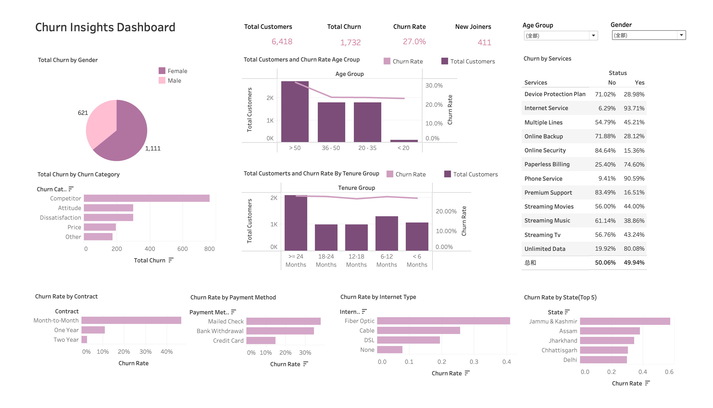
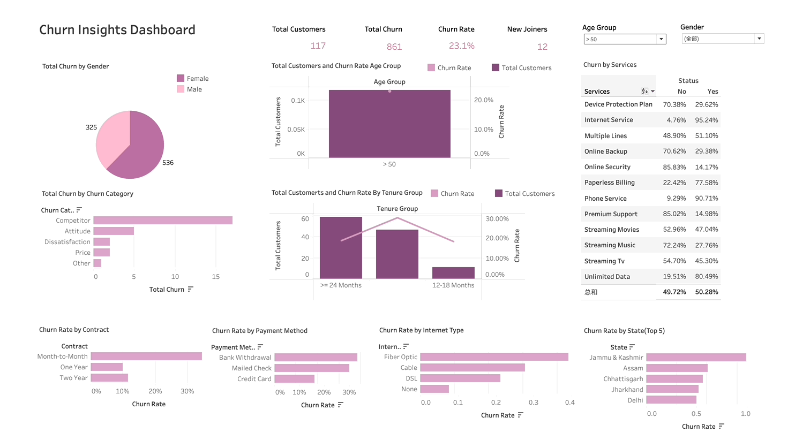

# 🛠️ Churn Insights Project

## Welcome! 

First and foremost, welcome! 🎉 Willkommen! 🎊 Bienvenue! 🎈

Thank you for visiting the `Churn Insights` project repository. This README file provides essential information about our project. Feel free to jump straight to one of the sections below, or simply scroll down to learn more.

-   [🛠️ Churn Insights Project](#🛠️-churn-insights-project)
    -   [Welcome!](#welcome)
    -   [Who Are We?](#who-are-we)
        -   [Project Summary](#project-summary)
        -   [Motivation and Purpose](#motivation-and-purpose)
        -   [The Challenge](#the-challenge)
        -   [Dashboard Features](#dashboard-features)
        -   [The Solution](#the-solution)
    -   [What Are We Doing?](#what-are-we-doing)
        -   [The Dashboard](#the-dashboard)
        -   [Forward Vision](#forward-vision)
    -   [Get Support](#get-support)
    -   [Collaboration](#collaboration)
    -   [Data Sources and Licensing](#data-sources-and-licensing)
        -   [Data Sources](#data-sources)
        -   [Licensing](#licensing)
    -   [Setup for Local Development](#setup-for-local-development)
    -   [Contribution](#contribution)
    -   [Thank You](#thank-you)
    -   [Glossary](#glossary)



## Who Are We? 

Our `Churn Insights` team, comprised of adept developers and data scientists, is driven by a shared passion for technology and data analytics. Our expertise in data analysis underpins our commitment to this project.

### Project Summary 

`Churn Insights` is an analytical platform dedicated to understanding and reducing customer attrition. Aimed at stakeholders such as business managers, data analysts, and customer relationship teams, it provides actionable insights through the careful analysis of customer data to identify patterns and reasons behind customer departures.

### Motivation and Purpose 

As a data analytics team, we strive to provide our target audience with a comprehensive tool that elucidates the various determinants of customer churn.

### The Challenge 

The business environment is intricate, often characterized by competitive market dynamics. There's a pronounced need for understanding customer behavior, especially to retain valuable customers and reduce churn rates.

### Dashboard Features 

With `Churn Insights`, you can explore customer trends, analyze attributes influencing churn, and view real-time churn predictions, all through an interactive and intuitive interface.

### The Solution 

Our `Churn Insights` dashboard is an empowering tool that enables:

-   The exploration of customer data with customizable features and filters.
-   Community-driven contributions to our database, fostering growth and inclusivity.
-   The synthesis of valuable insights to facilitate well-informed business decisions.

## What Are We Doing? 

### The Dashboard 


The current iteration of `Churn Insights` boasts:

-   Interactive filters for localized customer data analysis.
-   Correlative bar plots that elucidate the influence of customer features on churn.
-   An interactive map to visualize geographical data and churn distributions.
-   A table with an implemented churn probability slider for interactive filtering.

### Forward Vision 

We are poised to refine `Churn Insights` further, enhancing its interactivity and user interface. Our ambitions include the integration of advanced predictive analytics and the expansion of our dataset to encompass global markets.

## Project Building Steps

1.  **ETL Process in PostgreSQL from pgAdmin**
2.  **Data Cleaning in PostgreSQL**
3.  **Tableau Transformations**
4.  **Tableau Visualization & Enhancing Visuals**
5.  **Build Machine Learning Model** - EDA and build KNN, Decision tree, Random Forest, RBF SVM, Logistic regression models in Jupyter Notebook and finally pick the best model to predict and show the results.

## Get Support 

Encountered an issue or have a question? Feel free to [open an issue](#get-support) in this repository, and our team will be happy to assist you.

## Collaboration 

Our project is a collaborative endeavor, with each team member playing a pivotal role:

-   [Iris Luo](https://github.com/iris0614)
-   [Aishwarya Nadimpally](https://github.com/Aishwarya120111)

## Data Sources and Licensing 

### Data Sources 

Our analysis is anchored in robust customer datasets, obtained from various sources. Details are provided within the project repository.

### Licensing 

The `Churn Insights` codebase is MIT licensed, as found in the [LICENSE](LICENSE) in this repository.

## Setup for Local Development 
To run `Churn Insights` locally:

1.  **Clone the Repository**

    Clone the repository using Git:

    ``` bash
    git clone https://github.com/your-repo/churn-insights.git
    cd churn-insights
    ```

2.  **Set Up PostgreSQL Database**

    -   Open pgAdmin and create a new database.
    -   Run the SQL scripts provided in the `sql` folder to set up the ETL process and clean the data.

3.  **Tableau Visualization**

    -   Open Tableau and connect to your PostgreSQL database.
    -   Use the transformations provided in the `tableau` folder to create and enhance visuals.

4.  **Run Machine Learning Models**

    -   Navigate to the `notebooks` folder.
    -   Open the Jupyter Notebooks provided and run the machine learning models.

5.  **Create a Conda Environment**

    Create a Conda environment named `churn_insights` using the `environment.yml` file. This file contains all necessary dependencies:

    ``` sh
    conda env create -f environment.yml
    ```

6.  **Activate the Conda Environment**

    Activate the newly created environment:

    ``` sh
    conda activate churn_insights
    ```

7.  **Run Jupyter Notebook**

    ``` sh
    jupyter notebook
    ```

8.  **Open and Execute Notebooks**

    -   Open the notebooks from the Jupyter interface and run the cells to execute the machine learning models.

## 📊 Tableau Dashboard



## Contribution 

Dive into `Churn Insights` and join us in forging a more transparent and inclusive business environment. Your contributions are what make the open-source community such an amazing place to learn, inspire, and create. Any contributions you make are **greatly appreciated**. Please read our [Contribution Guidelines](CONTRIBUTING.md) for details on our code of conduct and the process for submitting pull requests to us.

## Thank You 

Thank you so much (Danke schön! Merci beaucoup!) for visiting our project. We hope you'll join us on this exciting journey to empower businesses with Churn Insights.

## Glossary 

-   README file: A document introducing an open project to the public and potential contributors, typically including installation, usage, and contribution information.
-   Repository (or Repo): A collection of documents related to your project, where you create and save new code or content, often hosted on platforms like GitHub or Bitbucket.
-   Roadmap: A document outlining the planned schedule of work for a project.
-   Milestone: An event or state marking a significant stage in development within the project.
-   Issue: The GitHub term for tasks, enhancements, bugs, discussions, and questions related to your projects.
